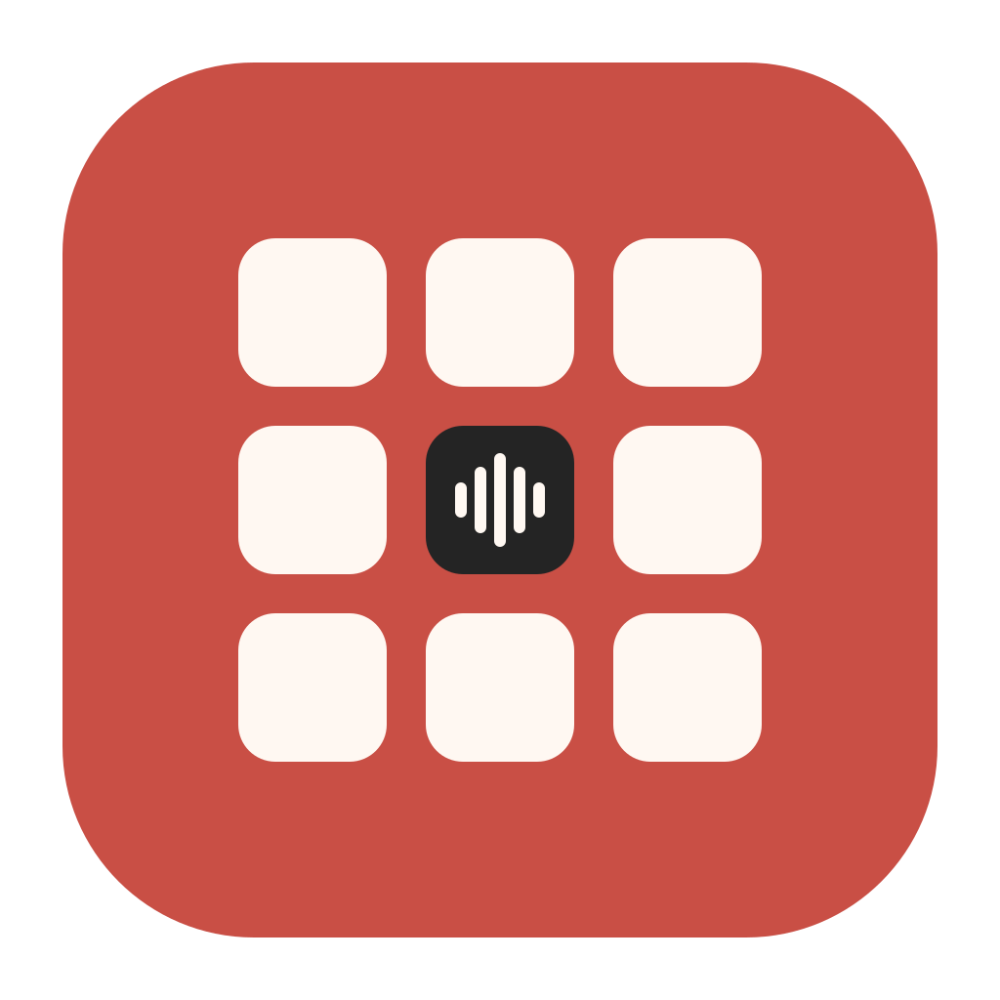

<p align="center">
  
</p>

# 知音输入法

知音输入法是一款面向 Windows 的中文输入法，重点优化电脑数字小键盘上的九键输入。
项目基于 [Rime](https://rime.im/) / [小狼毫](https://github.com/rime/weasel)
输入引擎及 [xuanli199/t9](https://github.com/xuanli199/t9) 九键方案开发。

## 功能

- 数字小键盘九键输入、九键位置模式、全拼和自然码双拼
- 横向候选词、逐项拼音注释和候选翻页按钮
- 小键盘 `/`、`*` 切换候选，`-`、`+` 翻页，`Enter` 上屏
- 知音悬浮状态栏与图形化设置中心
- 鼠标、触控板和手写笔输入
- Windows 语音输入、候选窗主题和新手引导

## 使用

运行环境：

- Windows 10 或 Windows 11
- 小狼毫 0.17
- Python 3.10+

下载项目后运行：

```bat
python -m pip install -r ZhiyinInput\requirements.txt
ZhiyinInput\启动知音输入法.bat
```

首次运行会部署知音方案并打开新手引导。之后按 `Win+Space` 选择
“知音输入法”即可使用。

## 常用按键

| 按键 | 功能 |
|---|---|
| 小键盘数字键 | 九键编码 |
| 小键盘 `*` / `/` | 后一个 / 前一个候选及拼音 |
| 小键盘 `+` / `-` | 下一页 / 上一页候选 |
| 小键盘 `Enter` | 上屏首选 |
| `Ctrl+Shift+1` | 切换输入方案 |
| `Ctrl+Shift+2` | 切换中英文 |
| `Ctrl+Alt+L` | 显示或隐藏悬浮状态栏 |
| `Ctrl+Alt+V` | 语音输入 |
| `Ctrl+Alt+H` | 手写输入 |

## 开发者

开发者：李子旺  
联系邮箱：2601121787@qq.com

## 许可证

知音新增代码采用 [Apache License 2.0](ZhiyinInput/LICENSE)。
Rime、小狼毫和原始九键方案遵循各自项目的许可证。
